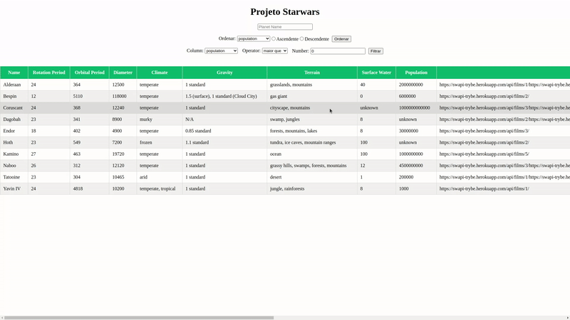

<h1 align="center">Project Star Wars Datatable</h1>

<p align="center">✅ Concluded</p>

## 💻 Instalando o projeto

Clone o repositório:

```
git clone git@github.com:lramos33/project-starwars-datatable.git
```

Acesse a pasta do repositório

```
cd project-starwars-datatable
```

Instale as dependências:
```
npm install
```

Execute a aplicação
```
npm start
```

## 🚀 Habilidades

- Utilizar a Context API do React para gerenciar estado;
- Utilizar o React Hook useState;
- Utilizar o React Hook useContext;
- Utilizar o React Hook useEffect;
- Criar React Hooks customizados.

## 🔧 Desenvolvimento

Nesse projeto foi desenvolvido uma lista com filtros de planetas do universo de Star Wars usando Context API e Hooks para controlar os estados globais.



## 📝 Requisitos do projeto

- [x] 1. Faça uma requisição para o endpoint `/planets` da API de Star Wars e preencha uma tabela com os dados retornados, com exceção dos da coluna `residents`;

- [x] 2. Filtre a tabela através de um texto, inserido num campo de texto, exibindo somente os planetas cujos nomes incluam o texto digitado;

- [x] 3. Crie um filtro para valores numéricos;

- [x] 4. Não utilize filtros repetidos;

- [x] 5. Apague o filtro de valores numéricos e desfaça as filtragens dos dados da tabela ao clicar no ícone de `X` de um dos filtros.

### Requisitos bônus:

- [x] 6. Ordene as colunas de forma ascendente ou descendente.


##

<div align="center">
  
  
  
</div>
